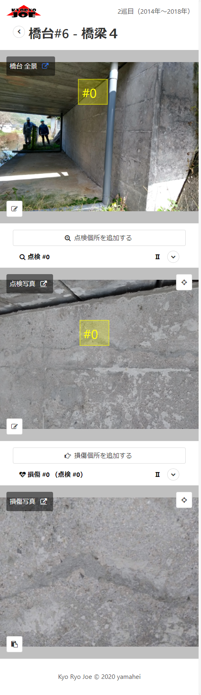

KyoRyoJoe/App
===========

はじめに
--------

KyoRyoJoeは地方自治体による直営橋梁点検の業務をサポートする[オープンソースソフトウェア](https://ja.wikipedia.org/wiki/オープンソースソフトウェア)です。
[ライセンス](doc/license.md)の範囲で、どなたでも無償で利用することができます。

ドキュメント
----

ドキュメントは移動しました。
* [kyoryojoe/doc](https://github.com/kyoryojoe/doc)

スクリーンキャプチャ（点検中イメージ）
--------------------------------------

